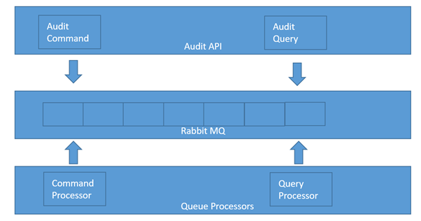
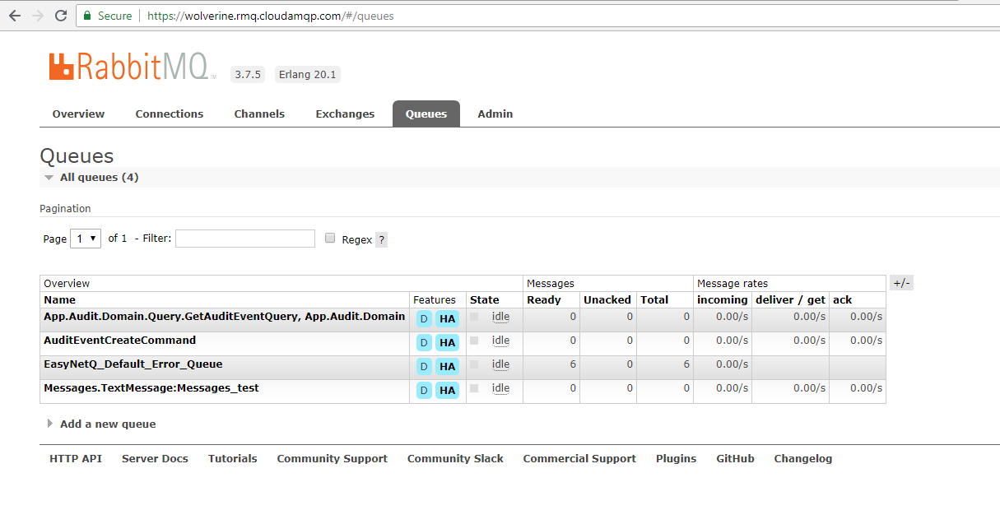
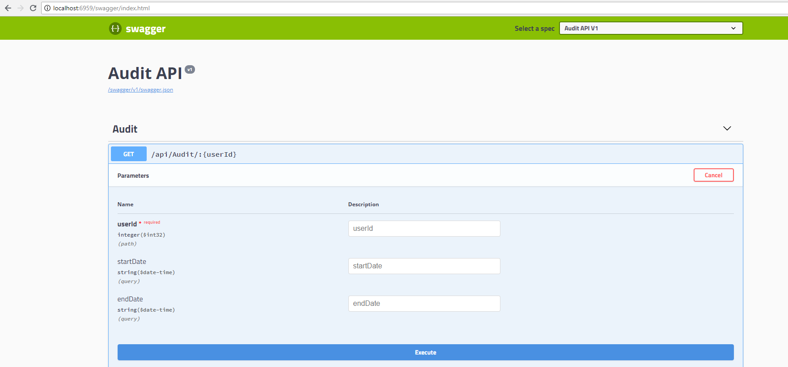

# Introduction 
Audit microservice that uses CQRS and RabbitMQ.

# Getting Started

1. Dependencies
- MySQL database server
- RabbitMQ server, using https://www.cloudamqp.com/

2. Configuration
- Constants.cs to change mysql Connection string
> public const string SqlConn = "server=xxxxx;user id=xxx;password=xx;persistsecurityinfo=False;database=audit;SslMode=none";

- CommonModule.cs to chage RabbitMQ server
> var bus = RabbitHutch.CreateBus("host=wolverine.rmq.cloudamqp.com;UserName=xxx;Password=xxxxx;virtualhost=xxxx");

2.	Start up
- Start App.Audit.CommandProcessor
>CMD: dotnet App.Audit.CommandProcessor.dll

- Start App.Audit.QueryProcessor
>CMD: dotnet App.Audit.QueryProcessor.dll

- run App.Audit.Api service 
- RabbitMQ using cloudamqp

# Build and Test
- App.Audit.UnitTest

- App.Audit.IntegrationTest
>Repository tests

- App.Audit.FunctionTest
> API test(NOT COMPLETE)

-Swagger Test
browser /swagger to go to swagger page

# Key Nuget Package used
- Autofac  - dependency injection framework
- FluentValidation - validation for requests
- EasyNetQ - RabbitMQ client
- Moq - Mocking for testing
- NBulder - Faking data
- MySql.Data- .net mysql 

# TODO:

- No Authentication module
- Finish Functional testing
- Queue policy configuration
- Using Two databases for Query and Command
